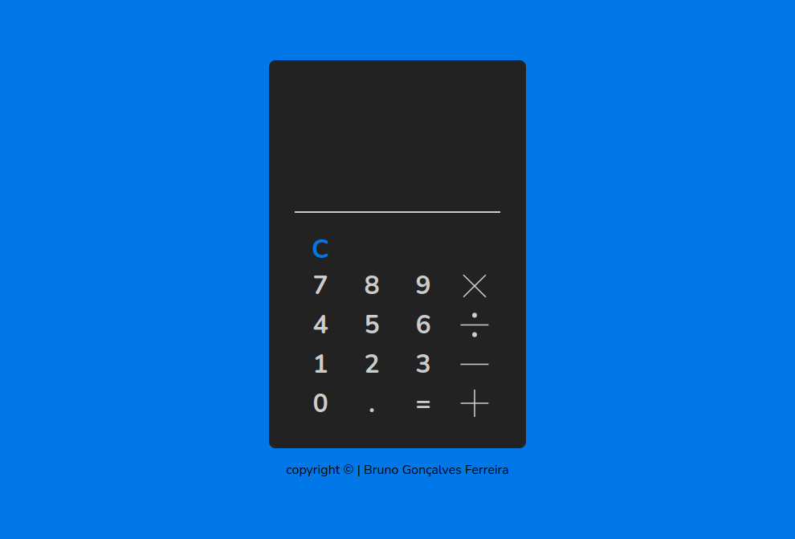
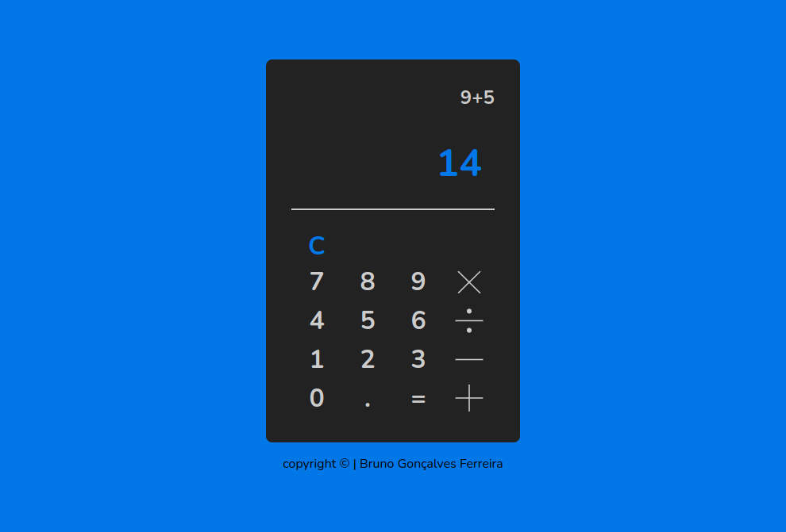

# Calculadora

Projetinho de uma calculadora usando javascript, eu mesmo construi o layout no [Figma](https://www.figma.com).

  <a href="#-tecnologias">Tecnologias</a>&nbsp;&nbsp;&nbsp;|&nbsp;&nbsp;&nbsp;
  <a href="#-projeto">Projeto</a>&nbsp;&nbsp;&nbsp;|&nbsp;&nbsp;&nbsp;
  <a href="#-layout">Layout</a>&nbsp;&nbsp;&nbsp;|&nbsp;&nbsp;&nbsp;

 

[Clique aqui para acessar](https://brunogoncalvesferreira.github.io/calculator/)

## 🚀 Tecnologias

Esse projeto foi desenvolvido com as seguintes tecnologias:

- [Javascript](https://developer.mozilla.org/pt-BR/docs/Web/JavaScript)
- [CSS3](https://developer.mozilla.org/pt-BR/docs/Web/CSS)
- [HTML5](https://developer.mozilla.org/pt-BR/docs/Web/HTML)
- [ViteJs](https://vitejs.dev/)
- [Figma](https://www.figma.com)

## 💻 Projeto

Nesse projeto, foi construido uma calculadora onde é possível realizar calculos matemáticos:

- Adição
- Subtração
- Multiplicação
- Divisão

## 🔖 Layout

Você pode visualizar o layout do projeto através [desse link](https://www.figma.com/file/Q6ByOIaQ9dM7FeT9cB8LdZ/Untitled?node-id=0%3A1). É necessário ter conta no [Figma](https://figma.com) para acessá-lo.

---

## Desenvolvedores/Contribuintes :

Responsável pelo desenvolvimento do projeto

[ Github](https://github.com/brunogoncalvesferreira)

Copyright | 2022

# calculator
